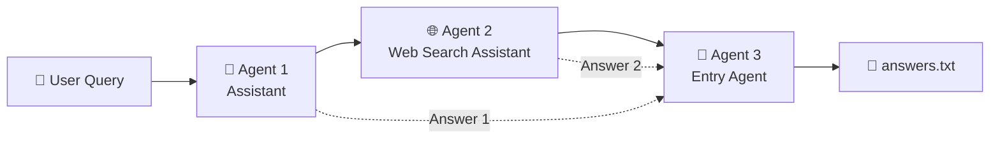
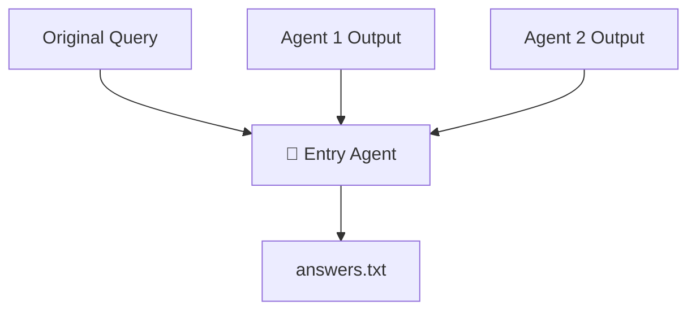
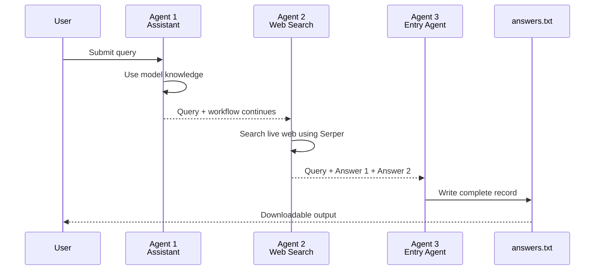

# 🤖 Support Crew
### 3-Agent CrewAI Buildathon

> **Ask → Research → Record**
>
> A sequential multi-agent AI application built with **CrewAI, OpenAI GPT-4o-mini, Serper, and Streamlit**.

---

## 🚀 Overview

**Support Crew** demonstrates a simple but practical multi-agent architecture where three specialized agents work together sequentially.

The application takes a user's query and processes it through three stages:



### Workflow

| Stage | Agent | Responsibility |
|---|---|---|
| 1 | 🧠 Assistant | Answers using model knowledge |
| 2 | 🌐 Web Search Assistant | Performs live web research using Serper |
| 3 | 📝 Entry Agent | Records the query and both answers into `answers.txt` |

The agents run using **`Process.sequential`**, ensuring that each stage executes in the required order.

---

# ✨ Key Features

- 🧠 **Model Knowledge** — First agent answers without web search
- 🌐 **Live Web Research** — Second agent uses Serper for current information
- 🔗 **Sequential Multi-Agent Workflow** — Built using CrewAI
- 📝 **Persistent Output** — Third agent records the complete interaction
- 📄 **Downloadable Record** — Download the generated `answers.txt`
- 🎨 **Streamlit UI** — Clean dashboard-style interface
- 🔐 **Environment-based API Keys** — API credentials are not hard-coded
- ⚡ **OpenAI GPT-4o-mini** — Lightweight model configuration for the application

---

# 🤖 The Three Agents

## 🧠 Agent 1 — Assistant

**Purpose:**  
Answer the user's question using the model's existing knowledge.

### Responsibilities

- Receives the original user query
- Uses OpenAI `gpt-4o-mini`
- Does **not** perform web searches
- Produces **Answer 1**

This agent demonstrates the difference between an answer generated from model knowledge and information obtained through live research.

---

## 🌐 Agent 2 — Web Search Assistant

**Purpose:**  
Research the user's query using live web information.

### Responsibilities

- Receives the original user query
- Uses **Serper** for web search
- Performs deterministic search queries
- Provides current web evidence to the agent
- Prioritizes current information for questions involving:
  - latest
  - current
  - status
  - version
  - recent developments

Produces **Answer 2**.

> For current-information queries, the web-search stage is designed to supplement the model's existing knowledge with live research.

---

## 📝 Agent 3 — Entry Agent

**Purpose:**  
Create the final durable record of the workflow.

### Responsibilities

- Receives the original query
- Receives Answer 1 from Agent 1
- Receives Answer 2 from Agent 2
- Records both answers
- Writes the combined record to `answers.txt`

The Entry Agent **does not independently answer, rank, or evaluate the query**.

It is a dedicated **records/output agent**.



---

# 🏗️ Architecture



---

# 🛠️ Technology Stack

| Technology | Purpose |
|---|---|
| Python | Application development |
| CrewAI | Multi-agent orchestration |
| CrewAI Tools | Web-search integration |
| OpenAI GPT-4o-mini | Language model |
| Serper | Live web search |
| Streamlit | User interface |
| PowerShell | Windows development environment |

---

# 📁 Project Structure

```text
D:\GENAI\CrewAI
│
├── app.py
├── README.md
├── requirements.txt
├── .gitignore
│
├── answers.txt
│   └── Generated by Agent 3 at runtime
│
├── support_crew_banner.png
│   └── Optional UI asset
│
└── venv/
    └── Local Python virtual environment
```

### Runtime files

`answers.txt` is generated by the application after the CrewAI workflow completes.

The Python virtual environment is local to the development machine and should not be committed to GitHub.

---

# ⚙️ Prerequisites

Before running the application, make sure you have:

- Python 3.13+
- An OpenAI API key
- A Serper API key
- A Python virtual environment
- Internet connectivity for live web search

---

# 🔧 Installation

## 1. Clone the repository

```powershell
git clone https://github.com/Vivekvinu13/Agent-CrewAI-Buildathon.git
cd Agent-CrewAI-Buildathon
```

## 2. Create a virtual environment

```powershell
python -m venv venv
```

## 3. Activate the virtual environment

```powershell
.\venv\Scripts\Activate.ps1
```

If PowerShell prevents script execution, use the appropriate execution-policy configuration for your Windows environment.

## 4. Install dependencies

```powershell
pip install -r requirements.txt
```

---

# 🔑 Environment Variables

The application requires:

```text
OPENAI_API_KEY
SERPER_API_KEY
```

The application uses:

```text
openai/gpt-4o-mini
```

as the default model.

### PowerShell

For the current PowerShell session:

```powershell
$env:OPENAI_API_KEY="YOUR_OPENAI_API_KEY"
$env:SERPER_API_KEY="YOUR_SERPER_API_KEY"
```

> ⚠️ **Never hard-code API keys inside `app.py`.**
>
> Never commit `.env` files, API keys, passwords, or other secrets to GitHub.

---

# ▶️ Run the Application

## Validate the Python file

```powershell
python -m py_compile app.py
```

If the command produces no output, the syntax check passed.

## Start Streamlit

```powershell
streamlit run app.py
```

The application will normally be available at:

```text
http://localhost:8501
```

---

# 🖥️ Streamlit Interface

The application provides a dashboard-style interface containing:

### 🔵 Agent 1 — Model Knowledge

Displays the response generated using the model's existing knowledge.

### 🟢 Agent 2 — Live Web Search

Displays the response generated using live Serper research.

### 🟠 Agent 3 — Combined Record

Displays the final record containing:

- Original query
- Answer 1
- Answer 2

The record is presented as read-only content.

### 📥 Download

The application provides a download option for:

```text
answers.txt
```

---

# 📄 Output Format

After the workflow completes, Agent 3 creates a record similar to:

```text
QUERY
=====

<Original user query>

ANSWER 1 - ASSISTANT
====================

<Agent 1 response>

ANSWER 2 - WEB SEARCH ASSISTANT
================================

<Agent 2 response>
```

The exact Answer 2 content depends on the live web research performed for the user's query.

---

# 🔄 Sequential Execution

The CrewAI workflow uses:

```python
Process.sequential
```

The execution order is:

```text
User Query
    │
    ▼
┌─────────────────────────┐
│ Agent 1                 │
│ Assistant               │
│ Model Knowledge         │
└────────────┬────────────┘
             │
             ▼
┌─────────────────────────┐
│ Agent 2                 │
│ Web Search Assistant    │
│ Live Serper Research    │
└────────────┬────────────┘
             │
             ▼
┌─────────────────────────┐
│ Agent 3                 │
│ Entry Agent             │
│ Records the results     │
└────────────┬────────────┘
             │
             ▼
        answers.txt
```

---

# 🧪 Example Query

Example:

```text
What is the latest version of OpenAI's chat model?
```

The workflow demonstrates two different information sources:

**Agent 1**

Uses the model's existing knowledge.

**Agent 2**

Performs live web research and uses current web evidence.

**Agent 3**

Records the original query and both responses without independently evaluating them.

This makes the difference between **model knowledge** and **live web research** visible in a single workflow.

---

# 🔐 Security

The repository intentionally excludes sensitive and generated files through `.gitignore`.

Recommended exclusions:

```gitignore
venv/
.env
__pycache__/
*.pyc
answers.txt
.streamlit/secrets.toml
```

Never commit:

- OpenAI API keys
- Serper API keys
- Passwords
- Access tokens
- Private credentials

---

# 🎯 Buildathon Objective

The project demonstrates how a simple multi-agent architecture can divide responsibilities across specialized agents:

```text
        ASK
         │
         ▼
     🧠 THINK
         │
         ▼
    🌐 RESEARCH
         │
         ▼
      📝 RECORD
```

Rather than making one agent responsible for everything, the workflow separates:

**Knowledge → Research → Recording**

This provides a clear and explainable multi-agent execution model.

---

# 📌 Project Status

| Component | Status |
|---|---|
| CrewAI workflow | ✅ Implemented |
| Agent 1 — Assistant | ✅ Implemented |
| Agent 2 — Web Search Assistant | ✅ Implemented |
| Agent 3 — Entry Agent | ✅ Implemented |
| Sequential execution | ✅ Implemented |
| Serper integration | ✅ Implemented |
| Streamlit UI | ✅ Implemented |
| `answers.txt` generation | ✅ Implemented |
| Download output | ✅ Implemented |
| GitHub repository | ✅ Published |

---

# 👨‍💻 Author

**Vivek Vinu**

Built as part of the **CrewAI Buildathon**.

---

## ⭐ Support Crew

**Three agents. One workflow. One complete record.**

> **Ask → Research → Record**
